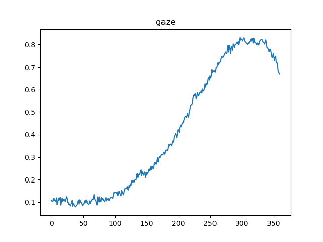
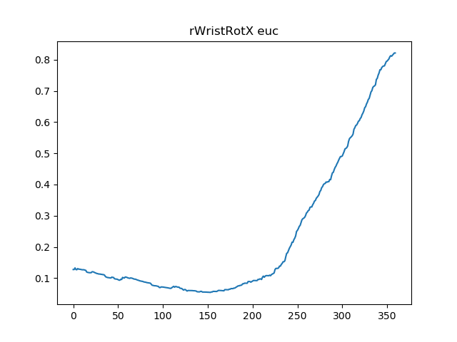
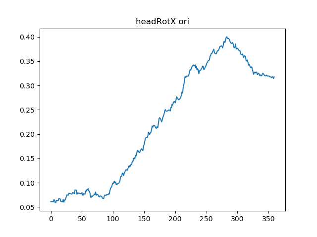

# Ensemble of LSTMs and feature selection for human action prediction
This is a pytorch implementation of the paper "Ensemble of LSTMs and feature selection for human action prediction" submitted to IAS-16 conference.
The results published in the paper (http://arxiv.org/abs/2101.05645) have been obtained in MATLAB.

## WIP
- [x] Process the MoGaze dataset
- [x] Extract and compare baselines
- [ ] Train models proposed in the paper
- [ ] Test models proposed in the paper

## Installing for the user

### Download the MoGaze dataset:
```
mkdir data
cd data
wget https://ipvs.informatik.uni-stuttgart.de/mlr/philipp/mogaze/mogaze.zip
unzip mogaze
```

### Install the requirements of our project:

```
cd ..
python3 -m pip install -r requirements.txt --user
```
Note that you might need to manually install pytorch as in: https://pytorch.org/get-started/locally/


### Install humoro and its dependencies

We have provided the humoro repository needed for extracting the data (version Dec 8 2020,  543dea9).
If you want to install it from the source run:

```
cd src
rm -r humoro
git clone https://github.com/PhilippJKratzer/humoro.git
```
Do as in: https://humans-to-robots-motion.github.io/mogaze/getting_started

```
python3 -m pip install --upgrade pip --user
sudo apt install qt5-default
cd humoro
python3 -m pip install -r requirements.txt --user
sudo python3 setup.py install
```

## Installation for venv

Alternatively, if you want to use virtual environment, please follow these instructions instead:

```
python3 -m venv "ensemble-env"
source ensemble-env/bin/activate
python3 -m pip install -r requirements.txt
```
### Download mogaze
```
mkdir data
cd data
wget https://ipvs.informatik.uni-stuttgart.de/mlr/philipp/mogaze/mogaze.zip
unzip mogaze && rm mogaze.zip
```
### Download humoro, install its dependencies
```
cd ../src
rm -rf humoro
python3 -m pip install --upgrade pip setuptools
sudo apt install qt5-default
git clone https://github.com/PhilippJKratzer/humoro.git
```
### Install humoro and relevant packages
```
cd humoro
pip install -e .
python3 -m pip install -r requirements.txt
sudo python3 setup.py install
```

## Running the ensemble-LSTM

To extract MoGaze data needed for training and testing of our model please run (from the src folder):

`python3 extract_data.py`

`python3 split_data.py` 

Example of labeled data in /data/processed:


To test baselines use 
`python3 test.py` 






