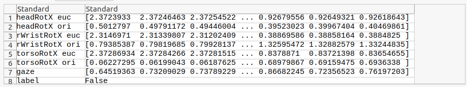
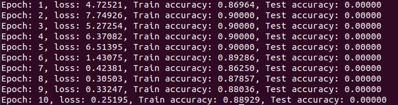
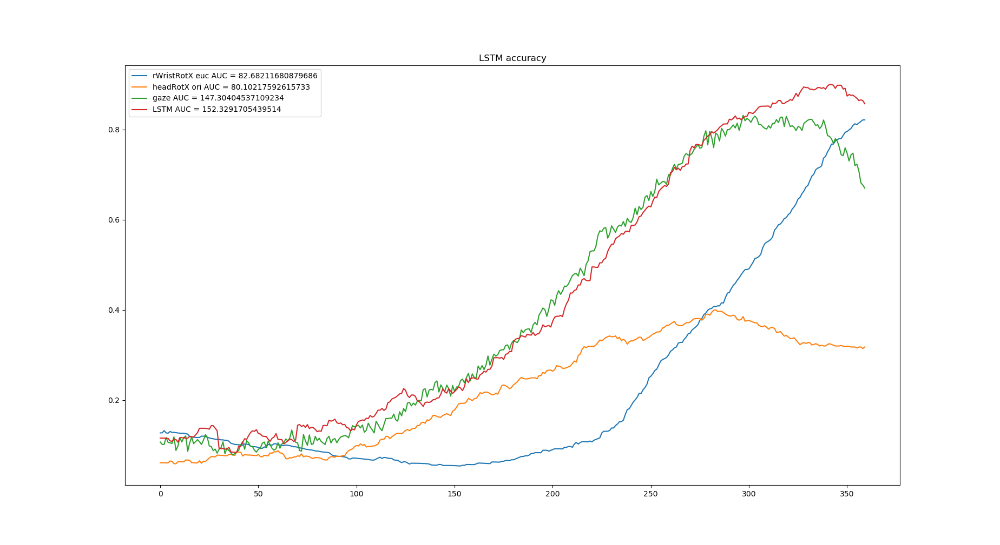
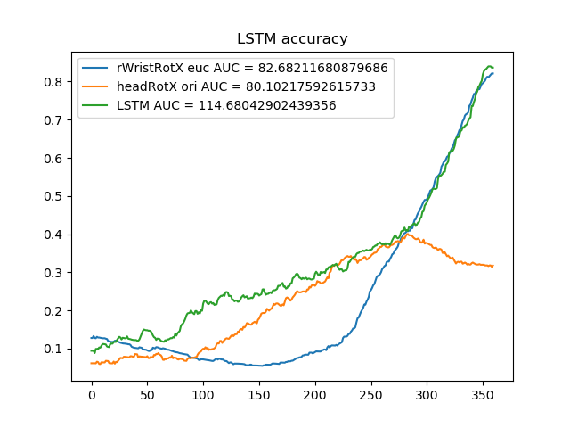

# Ensemble of LSTMs and feature selection for human action prediction
This is a pytorch implementation of the paper "Ensemble of LSTMs and feature selection for human action prediction" submitted to IAS-16 conference.
The results published in the paper (http://arxiv.org/abs/2101.05645) have been obtained in MATLAB.

## WIP
- [x] Process the MoGaze dataset
- [x] Extract and compare baselines
- [x] Train models proposed in the paper
- [x] Test models proposed in the paper

-----
### Installation for the user

Download the MoGaze dataset:
```
mkdir data
cd data
wget https://ipvs.informatik.uni-stuttgart.de/mlr/philipp/mogaze/mogaze.zip
unzip mogaze
```

Install the requirements of our project:

```
cd ..
python3 -m pip install -r requirements.txt --user
```
Note that you might need to manually install pytorch as in: https://pytorch.org/get-started/locally/


Install humoro and its dependencies

We have provided the humoro repository needed for extracting the data (version Dec 8 2020,  543dea9).
If you want to install it from the source run:

```
cd src
rm -r humoro
git clone https://github.com/PhilippJKratzer/humoro.git
```
Do as in: https://humans-to-robots-motion.github.io/mogaze/getting_started

```
python3 -m pip install --upgrade pip --user
sudo apt install qt5-default
cd humoro
python3 -m pip install -r requirements.txt --user
sudo python3 setup.py install
```
-----

### Installation in virtual environment (venv)

Alternatively, if you want to use virtual environment, please follow these instructions instead:

```
python3 -m venv "ensemble-env"
source ensemble-env/bin/activate
python3 -m pip install -r requirements.txt
```
Download mogaze
```
mkdir data
cd data
wget https://ipvs.informatik.uni-stuttgart.de/mlr/philipp/mogaze/mogaze.zip
unzip mogaze && rm mogaze.zip
```
Download humoro, install its dependencies
```
cd ../src
rm -rf humoro
python3 -m pip install --upgrade pip setuptools
sudo apt install qt5-default
git clone https://github.com/PhilippJKratzer/humoro.git
```
Install humoro and relevant packages
```
cd humoro
pip install -e .
python3 -m pip install -r requirements.txt
sudo python3 setup.py install
```
-----
### Running the ensemble-LSTM

To extract MoGaze data needed for training and testing of our model please run (from the src folder):

`python3 extract_data.py`

`python3 split_data.py` 

Example of labeled data in /data/processed:




To train the net:

`python3 train.py`

For additional options use:
` python3 train.py -h`



Input features are in the config.py file:

`myfeatures = ["rWristRotX euc", "headRotX ori", "gaze"]`

And have to be matched with their mean value on the train set:

`my_mean = [1.515465204886579, 1.0749099015977657, 1.0]`

One can include differentiated hand positon with the `calculate_diff` variable.

To test the net:

`python3 test.py`





-----
### Citing

If you use this library in an academic context, please cite the following publication:

```
@article{Petkovic2021preprint,
  author    = {Tomislav Petkovi\'c and Luka Petrovi\'c and Ivan Markovi\'c and Ivan Petrovi\'c},
  title     = {Ensemble of LSTMs and feature selection for human action prediction},
  year      = {2021},
  url       = {https://arxiv.org/abs/2101.05645}
}
```

-----

### Contributors
Tomislav Petković and Luka Petrović who are with the [Laboratory for Autonomous Systems and Mobile Robotics (LAMOR)](https://lamor.fer.hr).

This research has also been carried out within the activities of the Centre of Research Excellence for Data Science and Cooperative Systems supported by the Ministry of Science and Education of the Republic of Croatia.

-----

### License

This library is released under the GPLv3 license, reproduced in the file [LICENSE.txt](https://bitbucket.org/unizg-fer-lamor/ensemble-lstm/src/master/LICENSE.txt) in the directory.
